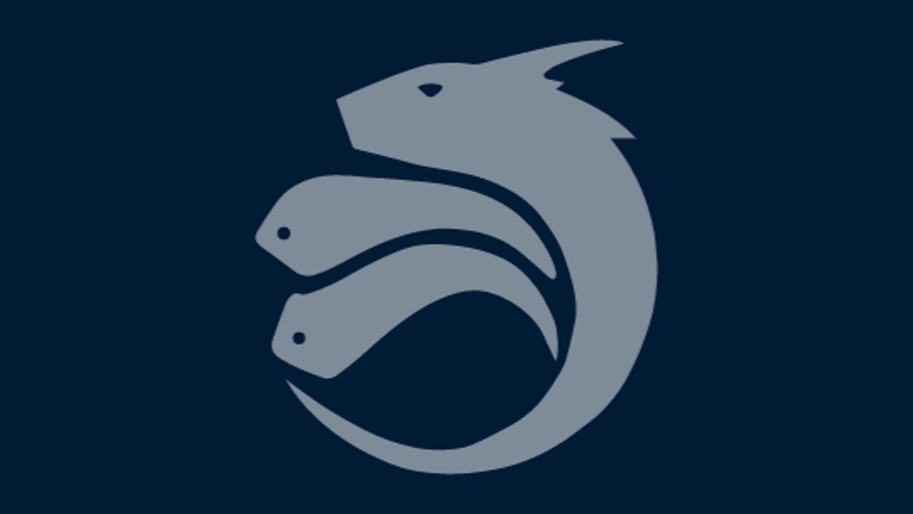

The Hydra Head Protocol, is a layer-2 scalability solution for Cardano, enabling the creation of off-chain ledgers for more efficient blockchain use. Developed as a joint effort by the Cardano Foundation and IOG, Hydra facilitates fast, private transactions within small networks (Hydra Heads) that later settle results on the Cardano mainchain. It's designed to be isomorphic, meaning transactions within Hydra Heads have the same capabilities as those on Cardano, but without the need for stake pools, ensuring full consensus among participants. Hydra aims to improve Cardano's scalability and efficiency, supporting a variety of use cases like payments, games, and marketplaces, with a focus on adoption and integration by developers. [**Read more**](https://cardanofoundation.org/en/news/hydra-head-protocol-an-open-source-solution-for-scalability/)

