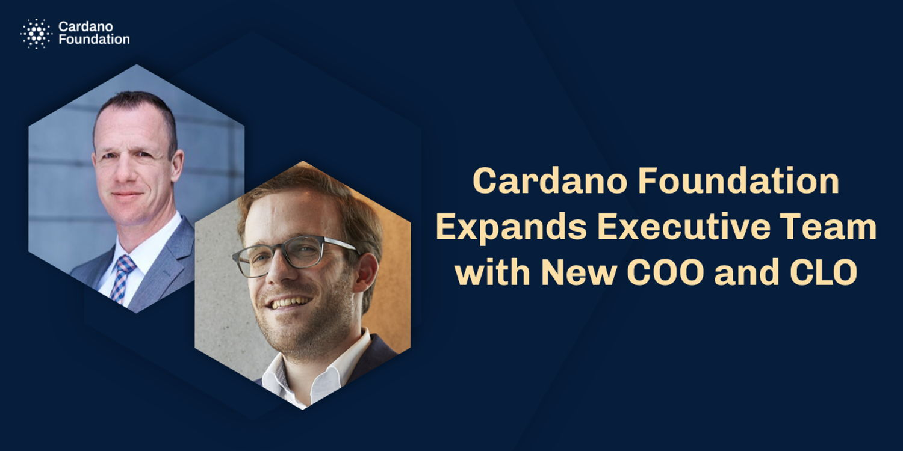

The Cardano Foundation has announced today the appointment of Andreas Pletscher as its Chief Operating Officer (COO) and Nicolas Jacquemart as its Chief Legal Officer (CLO). Pletscher joins the Foundation from PwC while Jacquemart joins from FINMA, the Swiss financial market supervisory authority. [Read more](https://cardanofoundation.org/en/news/cardano-foundation-expands-executive-team-with-new-coo-and-clo/)

