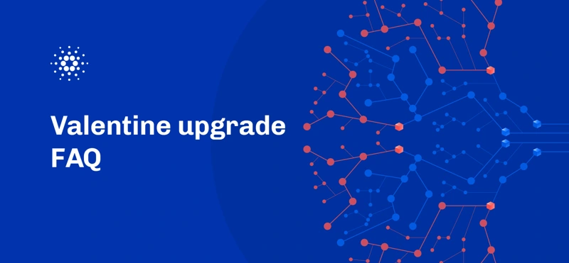

A set of frequently asked questions about the recent Valentine upgrade. It introduces built-in functions for ECDSA and Schnorr signatures alongside Cardano's native signature system, facilitating efficient cross-chain applications. This upgrade, requiring a focused hard fork, maintains the ledger era while expanding developer tools for secure and versatile DApp creation. It leverages popular cryptographic standards to enhance Cardano's usability and interoperability with other blockchains, ensuring high security through expert audits. [Read more](https://iohk.io/en/blog/posts/2023/02/27/valentine-upgrade-faq/)

