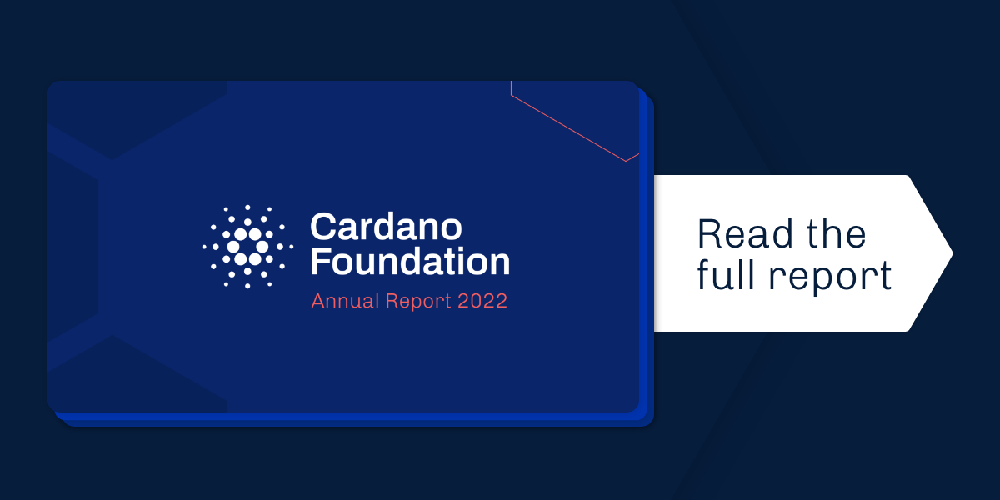

The Cardano Foundation launched its inaugural Annual Report today. From technical infrastructure support to spreading knowledge or establishing targeted partnerships and collaborations, the report showcases the Foundation’s work across its three core focus areas of operational resilience, education, and adoption. [Read more](https://cardanofoundation.org/en/news/cardano-foundation-launches-inaugural-annual-report/)

