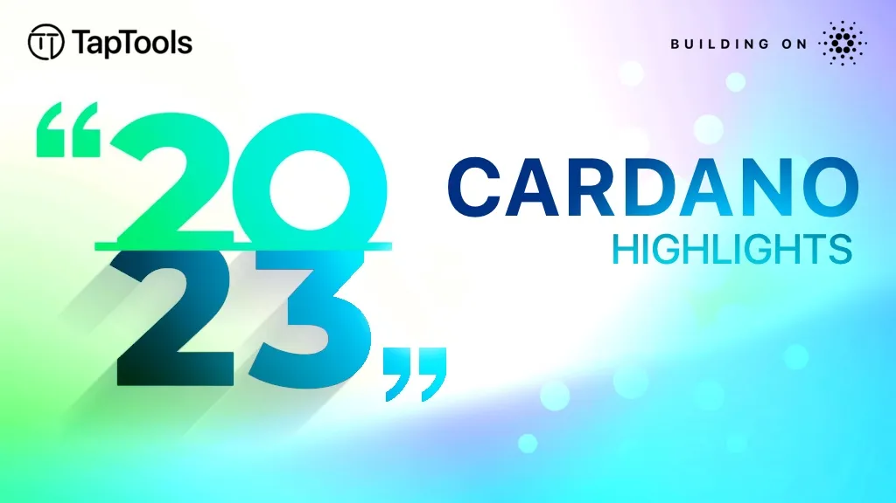

In 2023, Cardano's ecosystem thrived with major innovations, protocol launches, and significant events, marking a year of substantial growth and development. Highlights include the launch of Liqwid Finance, the Valentine Hardfork, VyFinance DEX, and groundbreaking NFT initiatives, enhancing DeFi and NFT market presence. Additionally, Marlowe's release democratized smart contract creation, while Spectrum Finance introduced a decentralized DEX. Events like Rare Evo and NFTxLV 2023 showcased the community's vibrancy, with ADAmail and OrcFax Oracle further expanding Cardano's Web3 and oracle capabilities. The year concluded with Rosenbridge, facilitating Cardano-Ergo interoperability, setting a strong foundation for future innovation. 

[**Read more**](https://medium.com/tap-in-with-taptools/2023-cardano-highlights-cfae20091b57)

