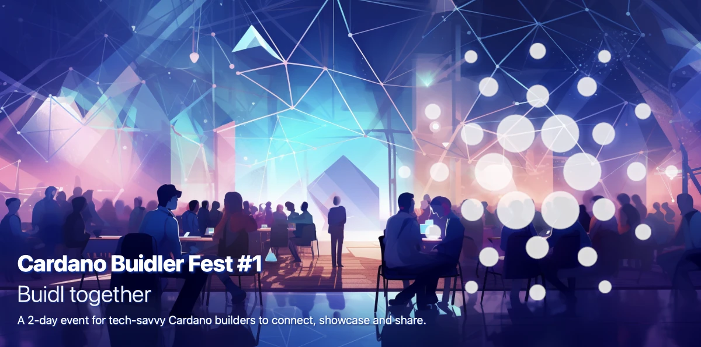

The concept of a technical-focused Cardano event, Cardano Buidler Fest, was born from discussions among developers working on Hydra in 2023. Recognizing a gap in existing Cardano events, which cater to a broader audience, this fest aims to bridge the divide between developers on the Cardano platform and those building applications on it. It seeks to provide a technology-centric space for in-depth discussions, sharing, and learning, addressing the complex and evolving nature of Cardano's technology and ecosystem. The event encourages participation from the community to shape its content, fostering collaboration and knowledge exchange among Cardano technologists and beyond. 

[**Read more**](https://buidl.2024.cardano.org/posts/2024-01-03-why-buidler-fest/)

