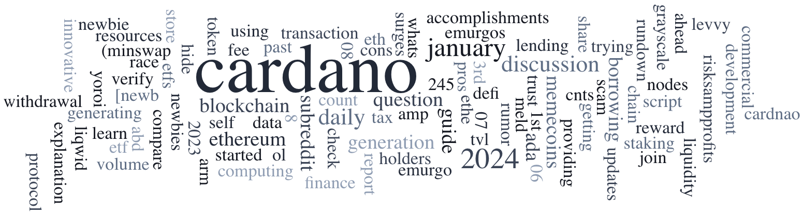

The Cardano Foundation extends heartfelt New Year wishes to the entire Cardano Community, anticipating another successful year in furthering Cardano’s development. On December 24th, 2023, IAGON launched its decentralized shared storage platform on the Cardano mainnet, revolutionizing data processing and storage solutions. The Cardano Builder Fest, a 2-day event for tech-savvy Cardano builders, will be held in Toulouse, France, on April 23-24, 2024, focusing on demos, open source, project presentations, and live coding. The Rosen Bridge team announced the live bridge between the Ergo and Cardano blockchains, enabling users to send and receive ADA and supported tokens without deploying smart contracts on the destination chain. dcSpark updated their JS/Rust SDK, fixing memory leaks and adding new features. The Cardano Foundation partnered with Petrobras to provide blockchain education for employees. Intersect will now oversee the administration of core Cardano infrastructure. CNCLI v6.0.0 was released, supporting node version 8.7.3. Genius Yield launched their order book DEX on Cardano.

 [**Read more**](https://forum.cardano.org/t/digest-january-8-2024-decentralized-data-storage-on-cardano-cardano-builder-fest-confirmed-rosen-bridge-live-between-ergo-and-cardano/126307) 

 

