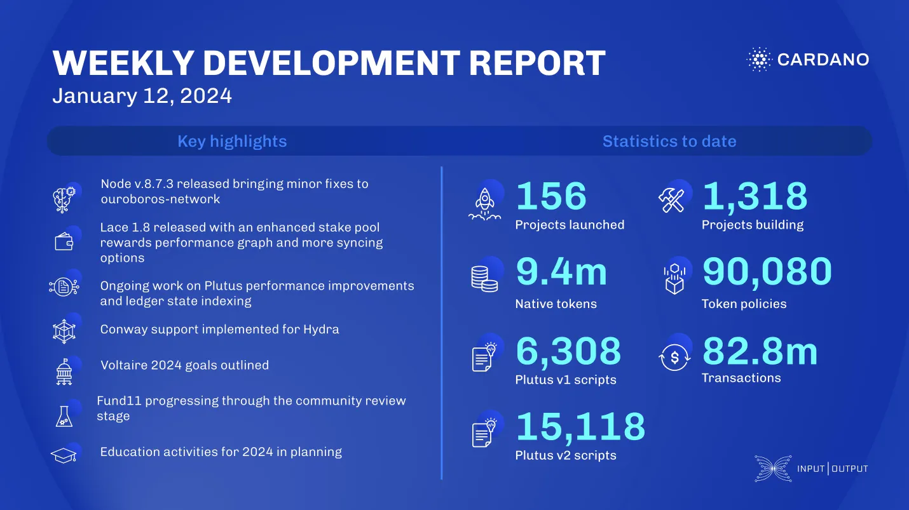

This week, the core technology teams released node v.8.7.3, fixing an outbound-governor issue and enhancing query versioning. The Lace team released v.1.8 with bug fixes and new features. Plutus tools improved synchronization and memory usage for Marconi and added new primitives for Plutus v3. Hydra completed Conway support and enhanced off-chain code. Mithril enabled direct certificate verification and improved node communications. Voltaire development continued with governance and constitution preparations. Project Catalyst held its first town hall and progressed Fund11 through the community review stage. The education team planned yearly activities and Mastering Cardano publication options.

 [**Read more**](https://www.essentialcardano.io/development-update/weekly-development-report-as-of-2024-01-12 

 

