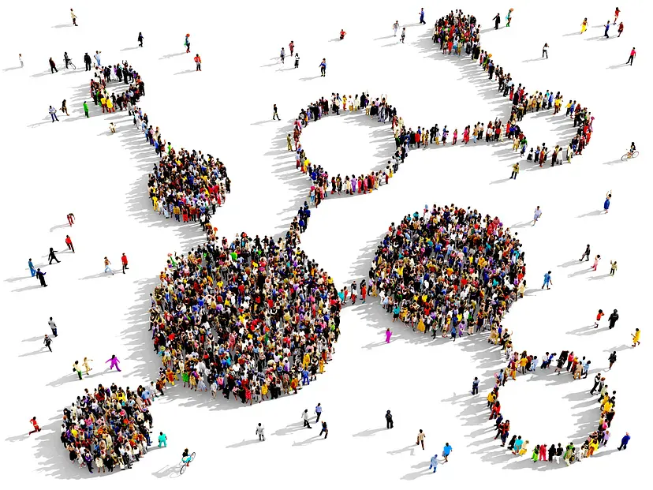

The Catalyst Team proposes Catalyst Working Groups to involve the Cardano community in shaping future funding rounds through data-driven analysis. This initiative emphasizes collaboration with the global community to foster innovation and decentralize the decision-making process for funding priorities. Fund11 voting will determine the community's interest in dedicating resources to this program, aiming to enhance Cardano's innovation funding by incorporating diverse insights and accelerating startup innovation. Successful proposals will kick off with Fund12 and include community-hosted events, with support and compensation provided to ensure active community participation in determining Cardano's funding objectives. 

[**Read more**](https://projectcatalyst.io/blog/catalyst-working-groups-roadmap)

