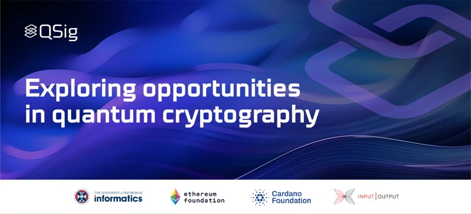

On January 26, 2024, the University of Edinburgh will host QSig, a research event bringing together academics and industry experts, including IOG’s professor Aggelos Kiayias and the Ethereum Foundation’s Justin Drake. The event will explore quantum computing’s applications in cryptography, blockchain science, and financial technology. QSig will highlight recent advancements in quantum cryptographic primitives that address longstanding blockchain security challenges. Discussions will cover the potential of quantum key distribution, encryption techniques, and one-shot signature schemes, focusing on their impact on blockchain technology and financial systems. Sponsored by Input Output, the Cardano Foundation, and the Ethereum Foundation, QSig aims to advance research in quantum-enhanced financial technologies.

 [**Read more**](https://iohk.io/en/blog/posts/2024/01/19/qsig-exploring-opportunities-in-quantum-cryptography/)

 

