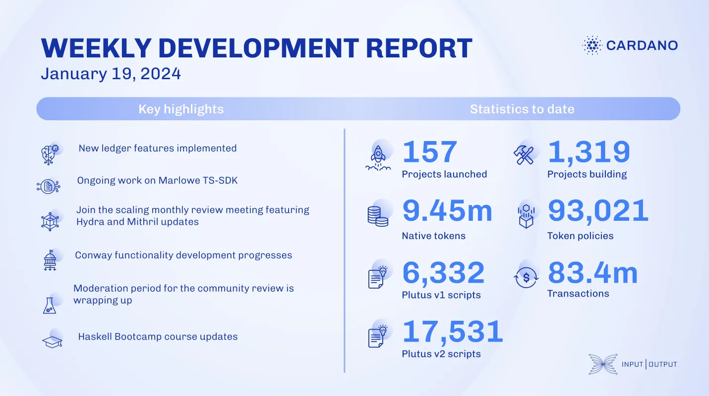

Over the past few weeks, the ledger team added new features, improved transaction fee estimation, and fixed various bugs. The Marlowe team benchmarked contract lifecycles, added Merkleized contract examples, and updated the Marlowe Run web application. The Hydra team improved workflows, addressed schema consistency, and enhanced log schema tests. Mithril enabled direct certificate verification, supported Conway era, and upgraded infrastructure. Voltaire continued Conway era development and updated SanchoNet documentation. Project Catalyst concluded the moderation period for community review, with voting starting January 25. The education team planned activities and updated the Haskell Bootcamp course.

 [**Read more**](https://www.essentialcardano.io/development-update/weekly-development-report-as-of-2024-01-19 

 

