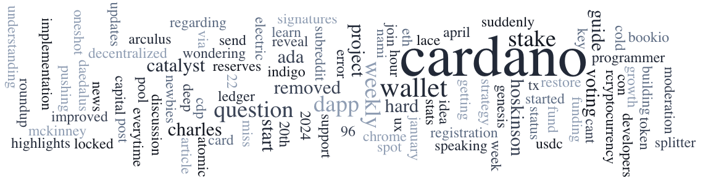

Derek, Co-Founder of VESPR Wallet, shares insights into the wallet’s innovative journey, focusing on user-friendly design, security measures, and responsiveness to feedback, making blockchain accessible for all. On January 20, 2024, a DRep workshop in Oslo, hosted by Thomas Lindseth and Eystein Hansen, focused on refining a Code of Conduct and discussing governance integration and educational content for DReps. IAMX partners with Klüh Multiservices to enhance service management using Cardano. Iagon expands globally with 197 nodes and a China patent. NEWM Studios launches blockchain-minted songs on Cardano Mainnet. Project Catalyst Fund11 voting starts January 25, 2024. Dex Hunter announces cross-chain integration. Marlowe website revamped.

 [**Read more**](https://forum.cardano.org/t/digest-january-22-2024-developer-blog-vespr-wallet-delegated-representative-drep-community-workshop-in-oslo/126789) 

 

