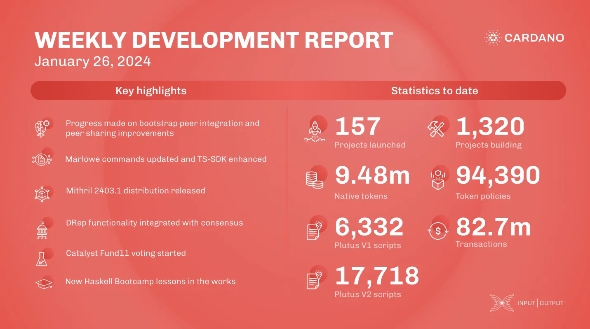

This week, the networking team integrated bootstrap peers and improved the tx-submission feature. The consensus team worked on Genesis and the second iteration of the ledger DB API for UTXO-HD. The Marlowe team added initial state commands, resolved balancing issues, and published validators on mainnet. Hydra prepared for version 0.15.0, polished hydra-chess, and enhanced testing. Mithril released a client NPM package, new distribution, and improved transaction certification. Project Catalyst started Fund11 voting, and the education team planned Cardano Days events and updated Haskell Bootcamp lessons.

 [**Read more**](https://www.essentialcardano.io/development-update/weekly-development-report-as-of-2024-01-26 

 

