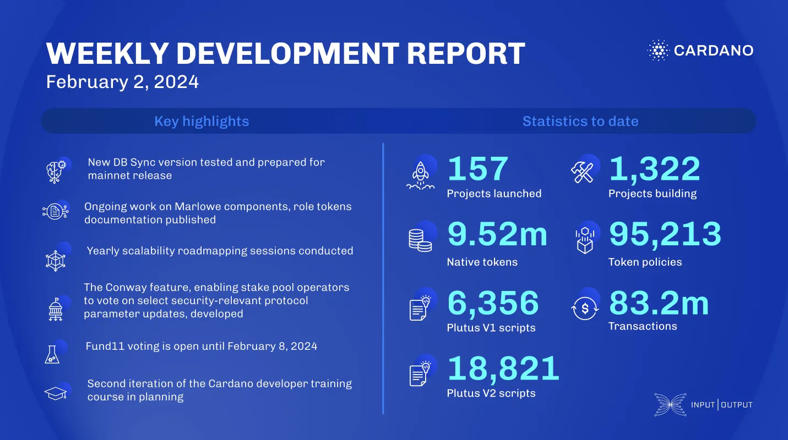

This week, the DB Sync team tested a new version for mainnet and integrated Conway functionality. The Marlowe team optimized performance, resolved Wolfram oracle references, and updated security documents. Hydra conducted roadmapping and improved APIs. Mithril enhanced transaction certification and node communications. Voltaire enabled stake pool operator voting and fixed critical bugs. Project Catalyst continued Fund11 voting, and the education team planned developer training with ABC.

 [**Read more**](https://www.essentialcardano.io/development-update/weekly-development-report-as-of-2024-02-02) 

 

