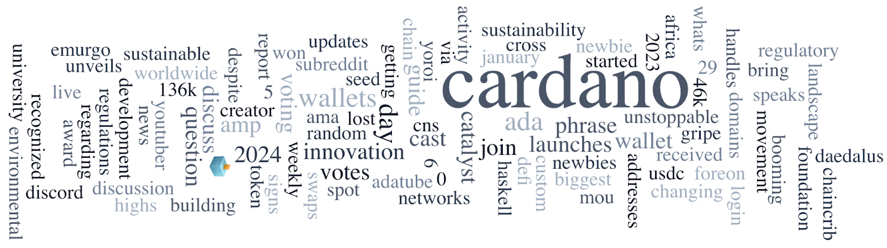

The Cardano Foundation published its 2023 Activity Report, highlighting key projects and operational resilience. The Voltaire Governance Parameter Survey invites community input on Cardano’s on-chain governance. AHLNET, led by Ola Ahlman, is featured in “Spotlight on Stake Pools.” Other news includes the DRep Workshop in Indianapolis, Project Catalyst Fund11 voting, cross-chain swaps by DexHunter, ERC20 token functionality, and the first Cardano Capture The Flag event.

 [**Read more**](https://forum.cardano.org/t/digest-february-5-2024-cardano-foundation-activity-report-2023-voltaire-governance-parameter-survey-a-spotlight-on-stake-pools-ahlnet/127409) 

 

