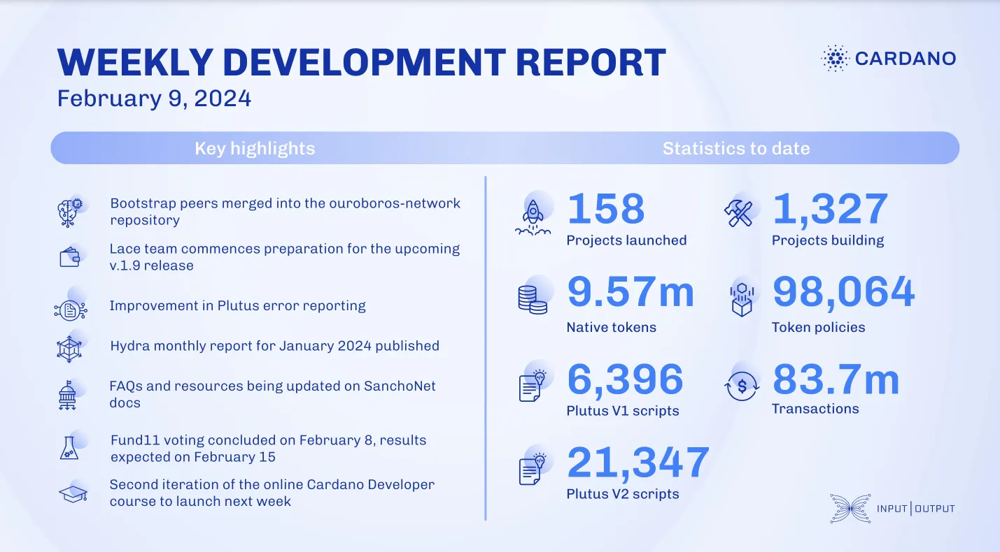

This week, the networking team integrated bootstrap peer changes, fixed CDDL errors, and improved tx-submission logic. The consensus team advanced UTXO-HD and epoch structure for Conway. Lace prepared for v.1.9 release. Plutus improved error reporting. Hydra and Mithril teams made significant progress, and SanchoNet updated governance features. Catalyst finished Fund11 voting.

 [**Read more**](https://www.essentialcardano.io/development-update/weekly-development-report-as-of-2024-02-09) 

 

