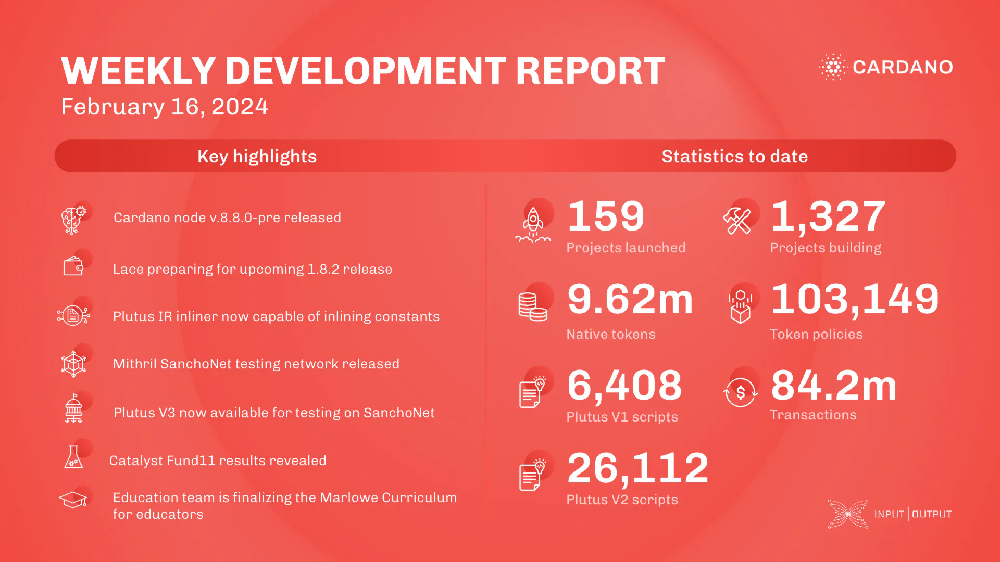

This week, the core technology teams released Cardano node v.8.8.0-pre, enabling Plutus V3 script testing on SanchoNet. DB-Sync began integration with the latest Cardano node version. The ledger team focused on fixes, testing, and developing the cuddle Haskell package for CDDL specification in Haskell. The Lace team addressed core API issues for an upcoming patch. The Plutus team improved the Plutus IR inliner, reducing script costs. The Hydra team worked on Conway support, deployed the Hydra explorer tool, and enhanced model-based testing. The Mithril team implemented a new data type for certifying transactions, upgraded the client library, and released a new Mithril network on SanchoNet. The release of Cardano node v.8.8.0-pre allows for experimentation with Plutus V3 on SanchoNet. Project Catalyst announced the results of Fund11, with 300 funded projects and a total of 1,647 projects in Catalyst history. The education team delivered the Cardano Developer Course with ABC and finalized the Marlowe Curriculum for Educators.

 [**Read more**](https://www.essentialcardano.io/development-update/weekly-development-report-as-of-2024-02-16) 

 

