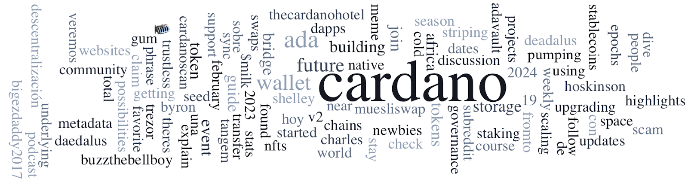

Messari’s ‘State of Cardano’ Q4 2023 report shows significant growth, moving from 34th to 11th in total value locked ranking, with notable stablecoin developments and infrastructure progress. Catalyst Fund 11 results revealed 300 projects funded from 8,000 wallets casting over 300,000 votes. The Cardano Foundation’s initiatives in education and research are highlighted in a recent blog. Rejuve’s Developer Blog discusses using AI and blockchain to address aging. Other news includes FINMA’s stance on staking protocols, Plutus V3 on SanchoNet, and Charles Hoskinson’s insights on the crypto industry.

 [**Read more**](https://forum.cardano.org/t/digest-february-19-2024-messari-report-cardano-q4-2023-catalyst-fund-11-results-cardano-foundations-activities-part-8-developer-blog-rejuve/127928) 

 

