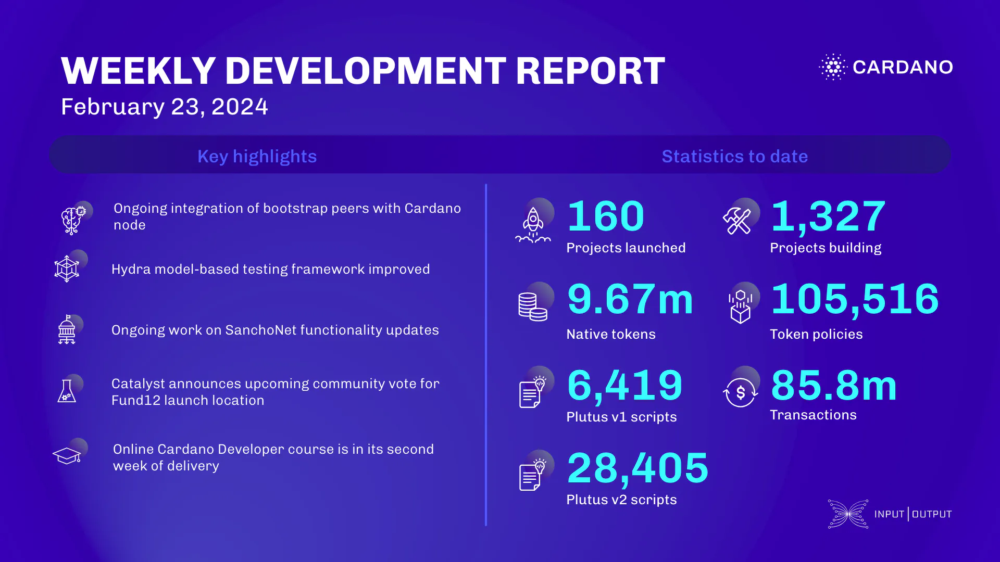

This week, the networking team integrated bootstrap peers with cardano-node for improved connectivity and enhanced the tx-submission logic. The consensus team addressed unnecessary block downloads, fixed a bug in the io-sim, and added support for configuring ledger state snapshots. The Hydra team advanced model-based testing, resolved validation issues, and integrated Haskell linting. The Mithril team developed a new data type for certifying Cardano transactions, enhanced browser verification with the WASM client, and deployed a new Mithril network on SanchoNet. SanchoNet focused on governance actions and tutorials. Project Catalyst announced a fun voting event to determine Fund12’s launch city and continued onboarding Fund11 projects. The education team delivered the Cardano Developer course and updated the Haskell Bootcamp course.

 [**Read more**](https://www.essentialcardano.io/development-update/weekly-development-report-as-of-2024-02-23) 

 

