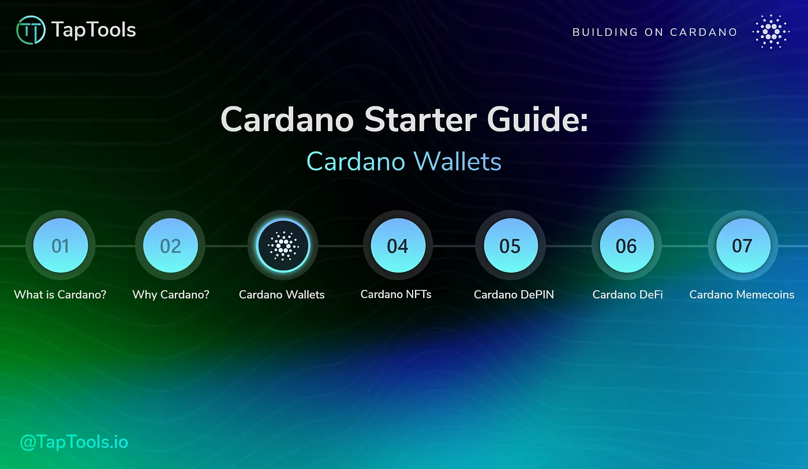

Cardano wallets, essential for blockchain interaction, range from hot wallets for convenience, cold storage for security, to full node wallets for transaction validation. Hot wallets like Nami, Typhon, Eternl, VESPR, and Lace offer various features. Cold storage options Ledger, Trezor, and Keystone provide offline security. The full node wallet Daedalus ensures maximum security by validating transactions locally. Each type caters to different user needs.

[**Read more**](https://medium.com/tap-in-with-taptools/cardano-wallets-ba4550a64db7) 

