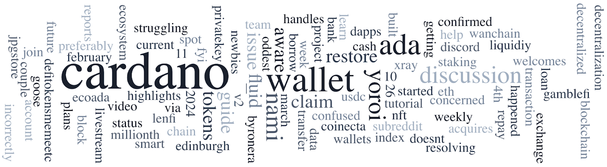

On March 1, 2024, at 15:13:47 CET, Cardano celebrated its 10 millionth block, minted by JAPAN4 pool. This milestone highlights the community's dedication since Shelley in 2020. The Edinburgh Decentralization Index (EDI) released dashboards showing Cardano's superior decentralization, with a Nakamoto coefficient of 58, compared to Bitcoin and Ethereum's 2. The Japanese Cardano community hosted a successful booth at Japan Web 3 Week Tokyo, with future events planned. Other news includes Rejuve’s decentralized aging research, IOG's new stablecoin XSY, CIP-1694 governance feature testing on SanchoNet, and Cryptoheadz's Cardano introduction event in California.

 [**Read more**](https://forum.cardano.org/t/digest-march-4-2024-cardano-celebrating-its-10-millionth-block-edinburgh-decentralization-index-blockchain-comparison-dashboards-japanese-cardano-community-at-web-3-week-tokyo/128549) 

 

