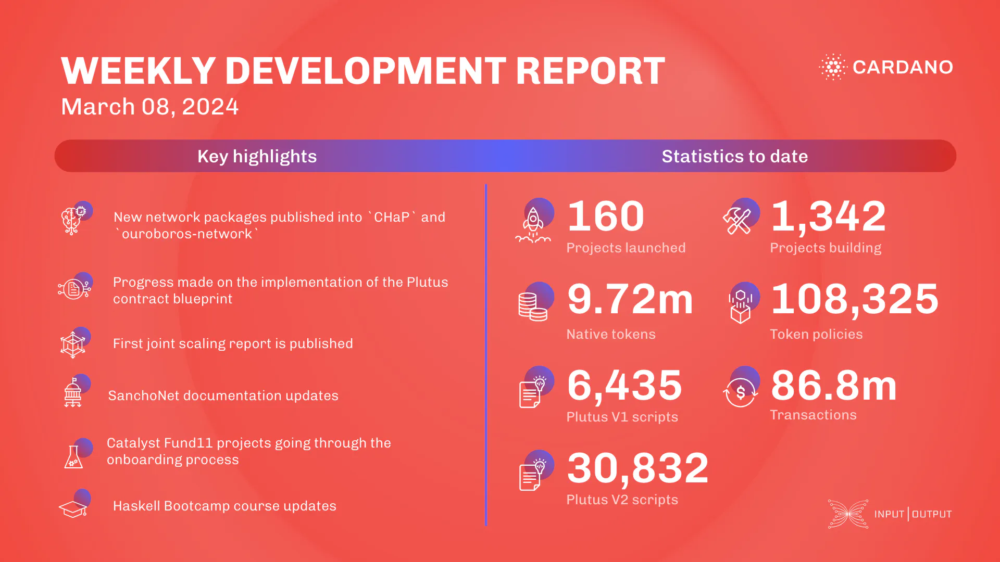

This week, the networking team published several packages, including `ouroboros-network-0.12.0.0`, and fixed syncing in bootstrap mode. The consensus team updated production libraries for UTXO-HD, measured sync times, fixed a snapshot interval bug, and added UTXO size analysis. The Plutus team advanced CIP-57 implementation for contract blueprints. The Hydra team prepared for the Conway switch, added a UI to the Hydra explorer, and made off-chain protocol changes. The Mithril team worked on transaction certification, improved the explorer, and implemented Prometheus monitoring. The SanchoNet team updated documentation. Catalyst continued onboarding Fund11 projects and began retrospective discussions for Fund12. The education team updated the Haskell Bootcamp and Cardano Developer courses.

 [**Read more**](https://www.essentialcardano.io/development-update/weekly-development-report-as-of-2024-03-08) 

 

