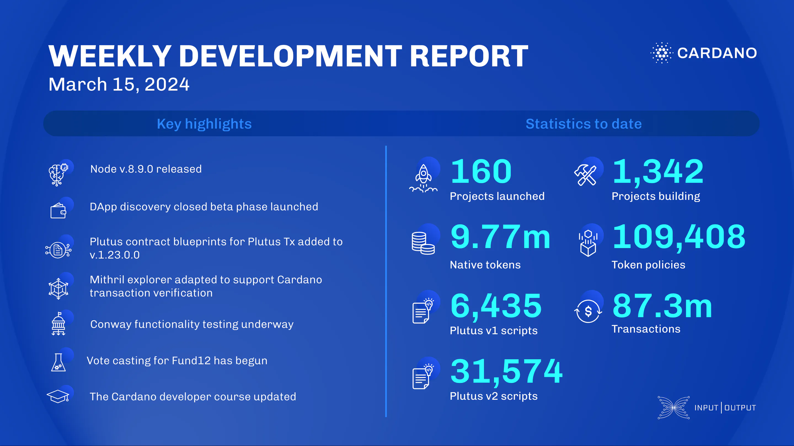

This week, the core technology teams released node v.8.9.0, introducing Genesis Lite bootstrap peers and fixing a dynamic block forging bug. The Lace team started closed beta testing for DApp discovery. The Plutus team added Plutus contract blueprints in the 1.23.0.0 release. The Hydra team worked on the cardano-api-classy library, improved Hydra Head explorer UI, error reporting, and refactored protocol logic. The Mithril team certified Cardano transactions, improved the Mithril explorer UI, and optimized communications between Mithril and Cardano nodes. The ledger team focused on Conway functionality, testing, and code cleanup. Catalyst held a non-funding vote for Fund12’s launch location and conducted a retrospective on Fund11. The education team wrote content for Mastering Cardano and updated the Cardano Developer Course.

 [**Read more**](https://www.essentialcardano.io/development-update/weekly-development-report-as-of-2024-03-15) 

 

