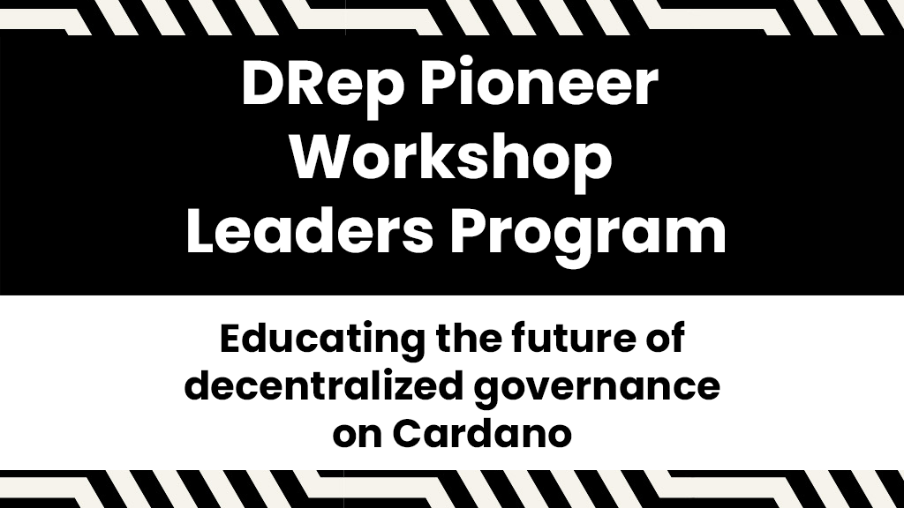

The DRep Pioneer Workshop Leaders Program, launched by Intersect, educates the Cardano community about decentralized governance as outlined in CIP-1694. This program, part of the Chang upgrade, trains Delegated Representatives (DReps) to participate in Cardano’s liquid democracy. Selected leaders from diverse regions will deliver training, fostering informed decision-making. This initiative supports Cardano’s transition into the ‘Voltaire’ era, emphasizing community-driven governance.

 [**Read more**](https://www.intersectmbo.org/news/drep-pioneer-workshop-leaders-program) 
 

 

