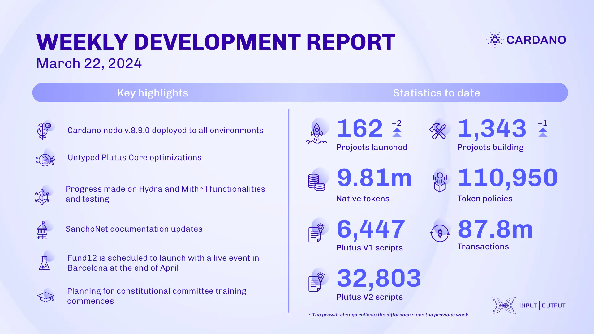

Over the past few weeks, the SRE team deployed cardano-node v.8.9.0 across all environments and created a new profile-cardano-db-sync-snapshots nixosModule. The consensus team merged an alternative fs-api interface, implemented a new diffusion pipelining criterion, and released consensus packages for node v.8.9.1. The Plutus team optimized UPLC and improved documentation. The Hydra team aligned the specification with the incremental de-commit implementation, updated to cardano-api v.8.40, and tested against cardano-node v.8.9.0. The Mithril team focused on transaction certification, UI improvements, metadata provision, and low-latency transaction signing. SanchoNet resources were updated with compatible components. Project Catalyst shared results from the first non-funding vote and announced Fund12’s launch in Barcelona at the end of April. The education team resumed the Cardano Developer Course and supported Voltaire’s constitutional committee training plans.

 [**Read more**](https://www.essentialcardano.io/development-update/weekly-development-report-as-of-2024-03-22) 

 

