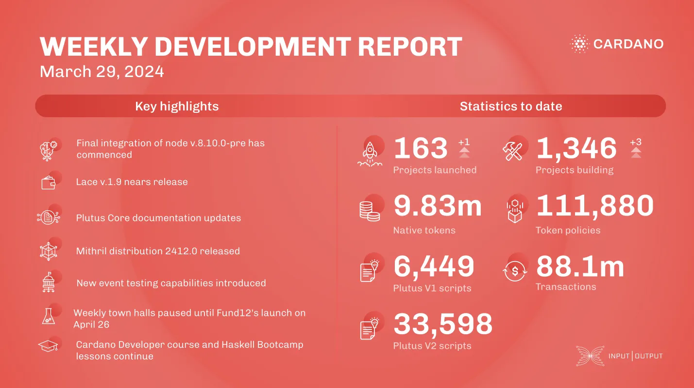

This week, the consensus team finalized integrating node v.8.10.0-pre for SanchoNet governance testing. The ledger team enhanced test frameworks and data quality, resolving issues and improving signal generation. The performance team conducted benchmarks for node v.8.9.1. The Lace team prepared for the release of Lace v.1.9. The Plutus team added a new guide on AsData functionality and optimized scripts. The Hydra team restored network test compatibility, fixed bugs, and prepared a new API format. The Mithril team released distribution 2412.0 with updates, continued transaction certification, and worked on a P2P network prototype. Voltaire & SanchoNet improved governance action handling and efficiency. Project Catalyst paused town halls until Fund12 launches on April 26 in Barcelona, introduced a formal cancellation policy, and planned for future accountability. The education team continued the Cardano Developer course and worked on Haskell Bootcamp Lesson 18.

 [**Read more**](https://www.essentialcardano.io/development-update/weekly-development-report-as-of-2024-03-29) 

 

