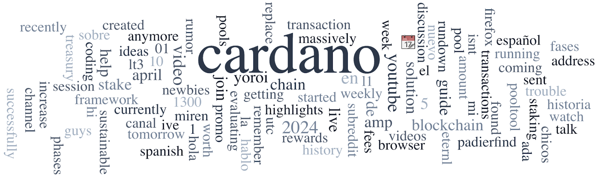

Last week, the "Cardano Girls 59" video released on March 25, 2024, went viral, uniting the Cardano community and highlighting the importance of female participation and collaboration. A V2 of the series is also available. Cardano was nominated for ‘Layer-1 Solution of the Year’ at the Blockchain Life Awards 2024, with voting open until April 11. Project Catalyst Fund12 will launch in Barcelona on April 26, featuring workshops and a launch party, with online streaming available. Other news includes a spotlight on Stake Pool ABLE, a new bug bounty program with Immunefi, and a strategic partnership between Emurgo and Encryptus.

 [**Read more**](https://forum.cardano.org/t/digest-april-2-2024-cardano-girls-video-viral-vote-for-cardano-as-layer-1-solution-of-the-year-register-for-project-catalyst-fund12-launch-in-barcelona/129956) 

 

