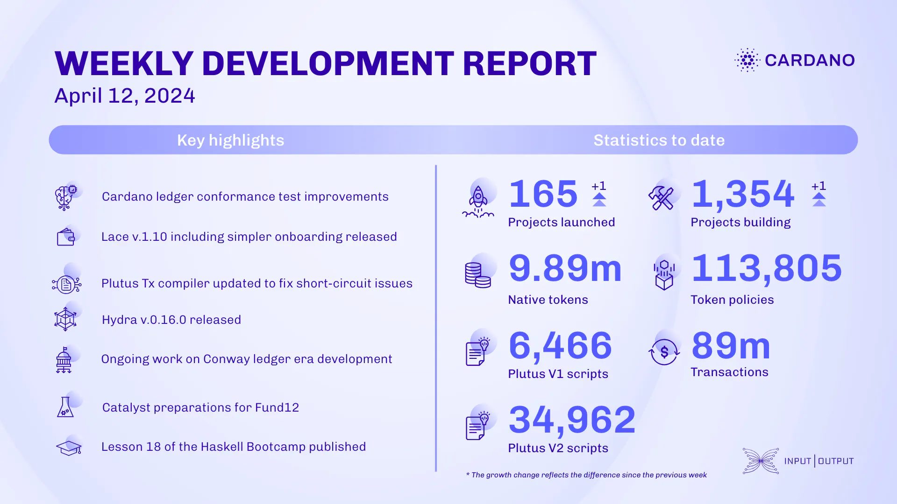

Over the past two weeks, the ledger team enhanced conformance tests and infrastructure, fixed node v.8.10 issues, and updated tooling. The Lace team released Lace v.1.10 with simpler onboarding, improved DApp-wallet interaction, and enhanced staking views. The Plutus team updated the Plutus Tx compiler for better short-circuiting, to be released in v1.26.0.0. The Hydra team released v.0.16.0, supporting cardano-node v.8.9.0, and updated Hydra clients. The Mithril team focused on transaction certification, scaling, and decentralizing signer registration. Voltaire & SanchoNet added Conway-related tests and ToJSON instances. Catalyst Fund12 launched in Barcelona on April 26. The education team supported Voltaire training and published Haskell Bootcamp Lesson 18.

 [**Read more**](https://www.essentialcardano.io/development-update/weekly-development-report-as-of-2024-04-12) 

 

