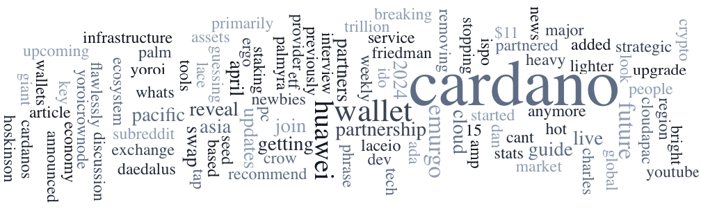

Node version 8.10.0-pre is live on SanchoNet, including governance changes, Plutus v3 support, and updates for the Constitution Committee. This version should only be used on SanchoNet, which was recently respun. Frederik Gregaard highlights blockchain’s transformative potential, emphasizing five enablers: decentralized identities, zero-knowledge proofs, oracles, secure bridges, and smart legal contracts. Ha Nguyen, a Vietnamese Meetup Organizer, joins as an Ambassador, enhancing Cardano community engagement. Important updates include Project Catalyst’s new cancellation policy and various Cardano-related events.

 [**Read more**](https://forum.cardano.org/t/digest-april-15-2024-node-version-8-10-0-pre-is-live-on-sanchonet-frederik-gregaard-on-the-potential-of-blockchain-technology-ambassador-stories-journal-with-ha-nguyen/130487) 

 

