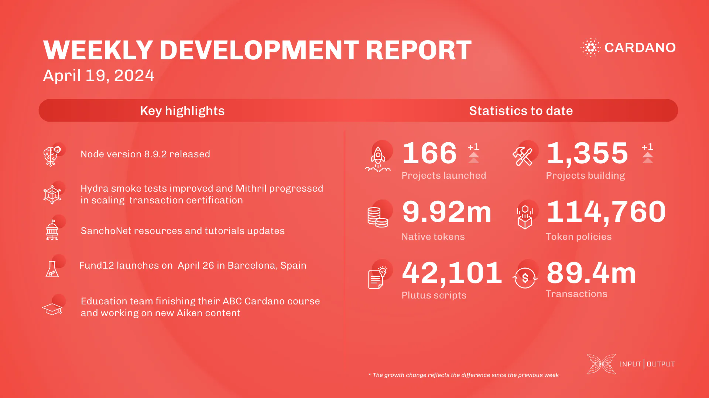

This week, the core technology teams released node v.8.9.2, resolving a peer-sharing issue. The SRE team made various environment improvements, including re-spinning the Voltaire private chain and updating SanchoNet. The networking team advanced Genesis support, and the consensus team implemented a new diffusion pipelining criterion. The Hydra team fixed a bug, refactored network functions, and prepared a cardano-api branch. The Mithril team worked on transaction certification, memory leak investigation, and signer registration decentralization. Voltaire & SanchoNet updated documentation and tutorials. Fund12 launched in Barcelona on April 26, with proposal submissions starting April 30. The education team wrapped up the ABC Cardano Developer course and developed new Aiken content.

 [**Read more**](https://www.essentialcardano.io/development-update/weekly-development-report-as-of-2024-04-19) 

 

