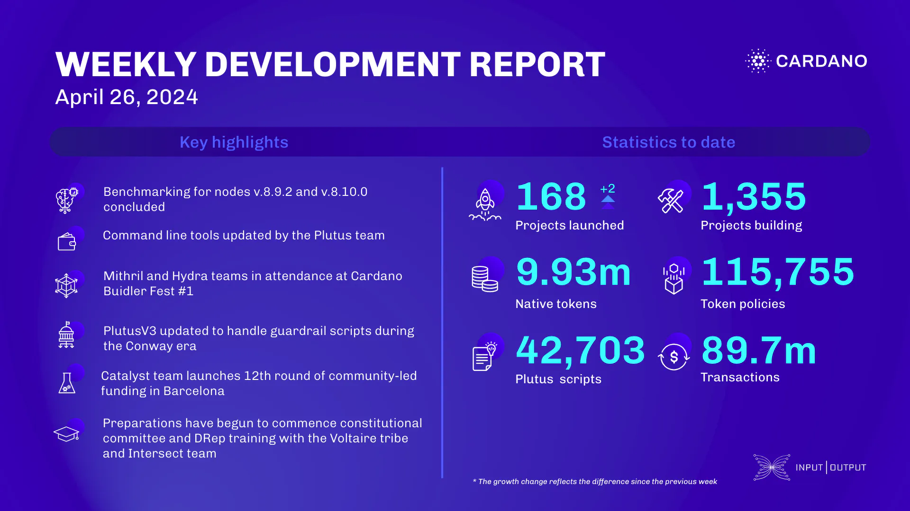

This week, the performance and tracing team concluded benchmarking nodes v.8.9.2 and v.8.10.0, designed quick queries for the analysis pipeline, and enhanced Prometheus output for better accessibility. The Plutus team unified command line tools into a single executable and added features. The Mithril team focused on transaction certification, memory issue fixes, and signer registration decentralization, while the Hydra team prepared for versioned network protocols and added property tests. The ledger team updated PlutusV3 in the genesis file, fixed bugs, and improved data generation for the Conway era. The Catalyst team launched Fund12 in Barcelona and began proposal submissions. The education team reviewed capstone projects and planned DRep training with the Voltaire tribe and Intersect team.

 [**Read more**](https://www.essentialcardano.io/development-update/weekly-development-report-as-of-2024-04-26) 

 

