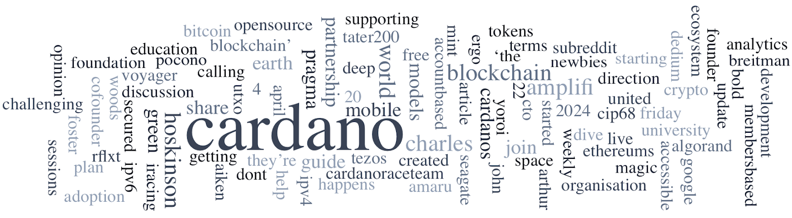

The Cardano Foundation, with Blink Labs, dcSpark, Sundae Labs, and TxPipe, launched PRAGMA, an open-source association for blockchain software development, aiming to support Cardano projects. The “Spotlight on Stake Pools” features ZW3RK, led by Haskell expert Moritz, contributing to the Cardano ecosystem. Ambassador Stories highlights Tim Brückmann, a marketing expert behind IAMX. Other news includes BuilderFest in Toulouse, DRep and Fund12 Workshops, a Cardano Foundation survey on SPO activities, Frederik Gregaard’s discussion on Cardano’s Interim Constitution, and IOG’s X Space on decentralization and cross-chain interoperability.

 [**Read more**](https://forum.cardano.org/t/digest-april-29-2024-cardano-welcomes-pragma-a-spotlight-on-stake-pools-zw3rk-ambassador-stories/130980) 

 

