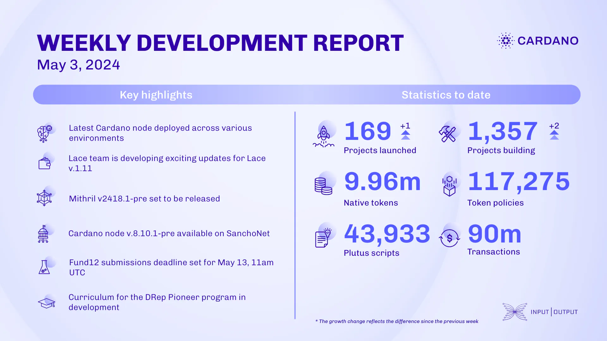

Over the past few weeks, the SRE team deployed Cardano node v.8.9.2 to various environments and v.8.10.1-pre to SanchoNet, rewriting the ouroboros-network-ops cluster. The consensus team reworked database arguments for UTXO-HD, reviewed the Peras innovation report, and supported networking work on big ledger peers. The Mithril team prepared distribution 2418.1-pre with broader CPU support, implemented transaction certification, and worked on signature and proof generation. They also started a global configuration file and investigated error logs. The node and CLI team released v.8.10.1-pre to SanchoNet, improved CI pipelines, and implemented build-estimate for transaction balancing. Fund12 entered the submissions phase with a deadline of May 13. The education team developed the DRep Pioneer program curriculum and attended the Cardano Buidler fest and Catalyst Fund12 launch.

 [**Read more**](https://www.essentialcardano.io/development-update/weekly-development-report-as-of-2024-05-03) 

 

