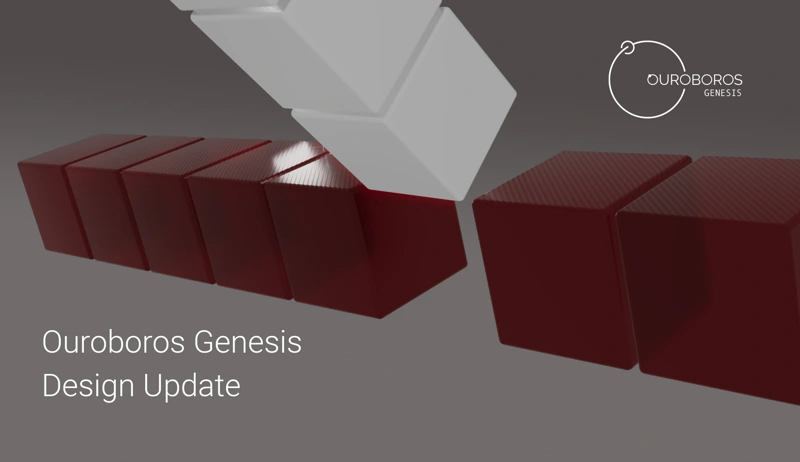

Ouroboros Genesis, the latest enhancement to Cardano’s consensus protocol, addresses the vulnerabilities of nodes joining or rejoining the network. It introduces concepts like ledger peers, lightweight checkpointing, limits on eagerness (LoE) and patience (LoP), and Genesis density disconnections (GDD). These measures prevent long-range and eclipse attacks, ensuring nodes can securely sync with the blockchain. The first Genesis-capable implementation is expected by Q3 2024, with ongoing optimizations to handle increased peer counts.

 [**Read more**](https://iohk.io/en/blog/posts/2024/05/08/ouroboros-genesis-design-update/) 

 

