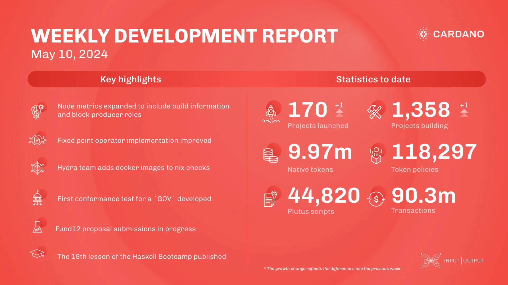

This week, the performance team analyzed Conway era benchmarks with DReps, improved error reporting, and supported the new CLI command for testnet data. Node metrics were expanded, and UTXO scaling benchmarks were completed. The networking team enhanced peer-sharing, worked on Genesis APIs, resolved bootstrap peer issues, and synchronized churn with outbound governor. The Plutus team improved fixed point operators for efficiency. The Hydra team refactored network protocols and made workflow fixes. Voltaire & SanchoNet finalized Conway era features, updated Plutus CostModels, and improved CI setups. Fund12 in Catalyst is ongoing with approaching deadlines. The education team launched the DRep Pioneer Program, published Haskell Bootcamp lesson 19, and continued work on Mastering Cardano.

 [**Read more**](https://www.essentialcardano.io/development-update/weekly-development-report-as-of-2024-05-10) 

 

