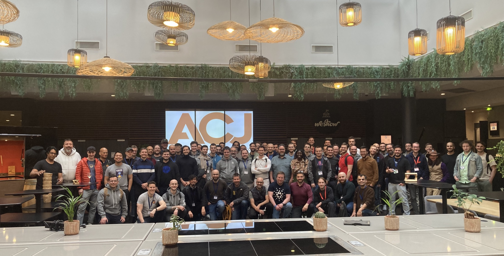

The first Cardano Buidler Fest was exhilarating and intense, yet enjoyable for attendees. It featured engaging presentations, lively discussions, and joyful dinners. With 102 participants, 53 proposed sessions, and 29 additional sessions, the event was packed with activities. Despite being sold out early, a participant from Peru managed to join. Feedback highlighted the perfect size, great venue, and excellent food, though improvements are needed in diversity and space for coding. Overall, the event fostered positive interactions and valuable insights.

 [**Read more**](https://buidl.2024.cardano.org/posts/2024-04-26-it-s-over/) 

 

