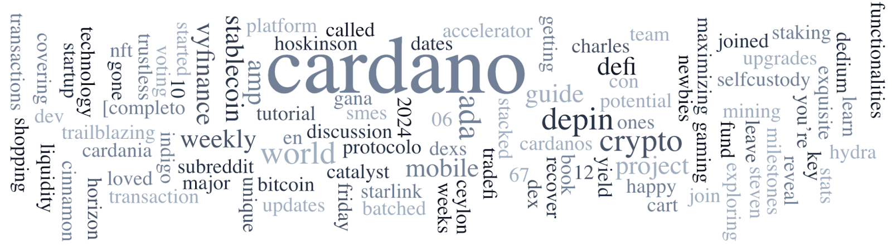

The Project Catalyst Fund12 proposal submission phase ended on May 13, 2024, with over 1200 proposals. Cardano Use Cases and Open categories can adjust proposals until May 16, with Community Review until June 6. Cardano Partners category proposals are due by June 6. The Cardano Foundation partnered with the Dubai Blockchain Center to launch a certification program on Cardano’s blockchain technology. Genius Yield’s Developer Blog highlights their Cardano-based DEX project. Other updates include #CardanoGirls, Cardano Builder Fest recap, governance actions, DRep Pioneer Program, and Cardano Summit 2024 early bird tickets.

 [**Read more**](https://forum.cardano.org/t/digest-may-13-2024-catalyst-proposals-submission-phase-ended-what-s-next-cardano-foundation-strategic-partnership-with-dubai-blockchain-center-developer-blog-series-genius-yield/131589) 

 

