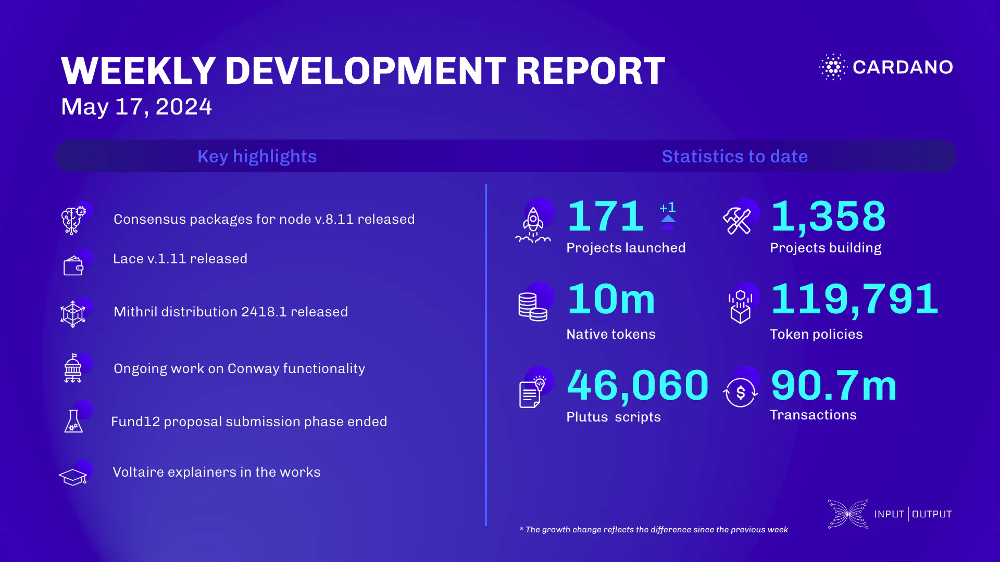

This week, the consensus team released node v.8.11, improving Praos chain order, leader schedule statistics, and node robustness. They also updated on Ouroboros Genesis design and setup a consensus technical working group. The performance team completed UTXO-HD benchmarks, and the Lace team launched Lace v.1.11 with enhanced NFT functionality and Trezor T integration. The Hydra team upgraded node networking, fixed transaction parsing, and experimented with reliability layer changes. The Mithril team released distribution 2418.1, supported broader CPU use, improved memory allocation, and optimized signature generation. Voltaire & SanchoNet added CLI commands for hard forks, adjusted protocol versions, and tested CIP-1694. Catalyst Fund12 received 1,283 proposals, with community review starting May 23. The education team worked on Voltaire explainers and Mastering Cardano content.

 [**Read more**](https://www.essentialcardano.io/development-update/weekly-development-report-as-of-2024-05-17) 

 

