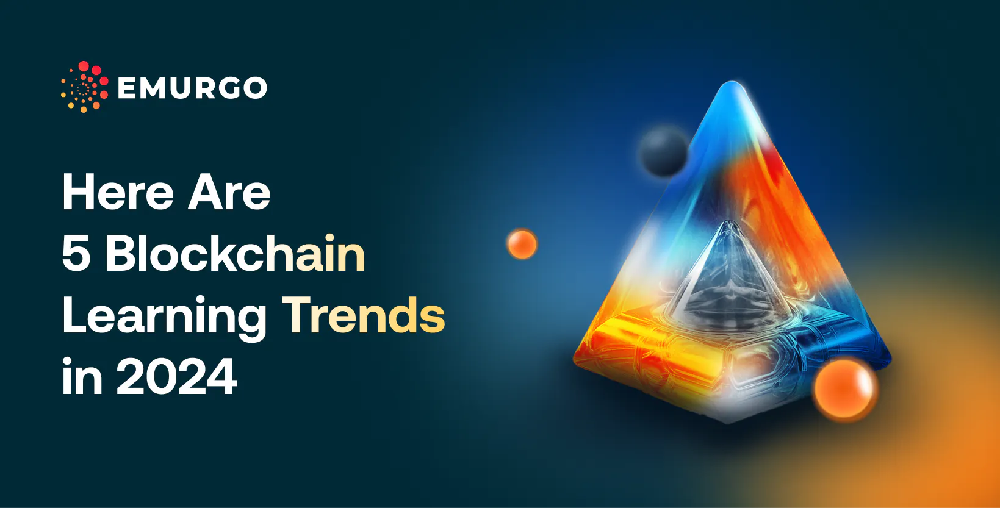

Blockchain education is evolving with increased mainstream interest and diverse learner backgrounds. Here are five trends:

	1.	Government Engagement: Governments are integrating blockchain services and creating educational programs for public sector employees.
	2.	University Courses: Universities are expanding blockchain education to undergraduate and non-technical programs.
	3.	Corporate Training: Companies are embracing blockchain, offering employee education through corporate programs.
	4.	Non-Technical Learning: Blockchain courses for non-technical people are growing, focusing on user security and industry practices.
	5.	Open Education Resources (OER): Universities are issuing blockchain-backed credentials and creating OER, attracting UNESCO’s attention.

 [**Read more**](https://www.emurgo.io/press-news/here-are-5-blockchain-learning-trends-in-2024/) 

 

