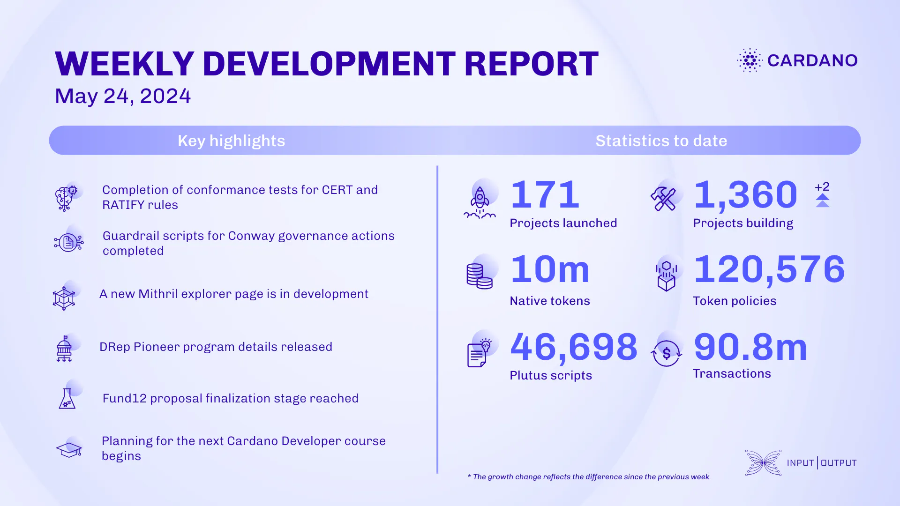

This week, the ledger team focused on conformance testing, completing tests for CERT and RATIFY rules and improving the constraint-generators framework. They also fixed the stake pool operator stake distribution calculation for voting. The Plutus team developed guardrail scripts for Conway governance actions, fine-tuned the PlutusV3 cost model, and collaborated with MLabs on new bitwise primitives. The Mithril team worked on Cardano transaction certification, scaling proof generation, low-latency certification, and a new explorer page for SPOs. They upgraded the testing network and removed deprecated commands. Work continued on SanchoNet documentation and the DRep Pioneer program with Intersect. Fund12 reached the proposal finalization stage, and development on Hermes and Catalyst voices progressed well. The education team is planning the next Cardano Developer course, advancing the Mastering Cardano series, and preparing an educational video about the constitutional committee.

 [**Read more**](https://www.essentialcardano.io/development-update/weekly-development-report-as-of-2024-05-24) 

 

