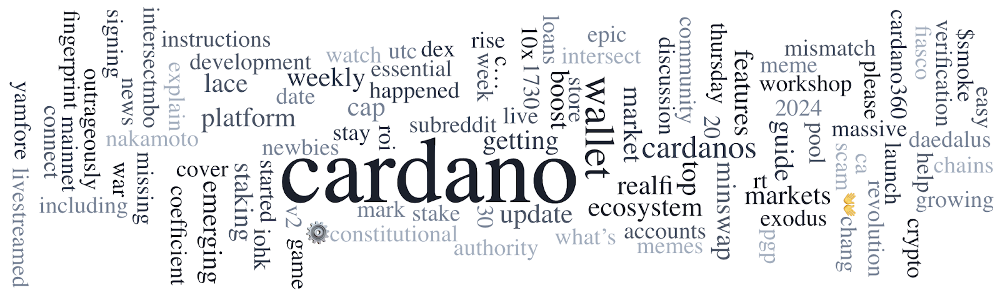

On May 23, 2024, Cardano’s SanchoNet achieved a historic milestone by initiating its first hard fork using CIP-1694 governance. Intersect seeks community input for drafting the Cardano Constitution with workshops worldwide. The Cardano Foundation introduced the MACS algorithm for efficient coin selection on UTxO blockchains at the IEEE conference. Other news includes updates from Dr. Lars Brünjes, CNTools, RealFi, leaderlogs, Catalyst Working Group, and SanchoNet.

 [**Read more**](https://forum.cardano.org/t/digest-may-27-2024-another-milestone-on-sanchonet-intersect-seeking-community-input-for-drafting-cardano-constitution-cardano-foundation-introduces-a-new-algorithm-for-efficient-coin-selection-on-utxo-blockchains/132175) 

 

