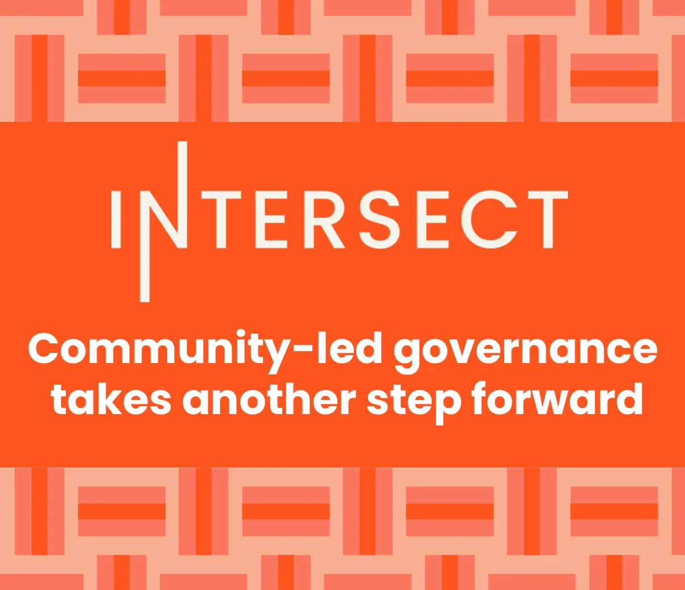

Cardano’s minimum viable on-chain governance framework outlines the transition towards on-chain governance, starting with an interim period for bootstrapping via formal rules. Key dates for community involvement include May 28 for registration opening, June 10 for closing, and June 13-23 for voting. An interim Constitutional Committee of seven members, including three elected community members, will oversee the initial phase. Community members passionate about governance are encouraged to apply.

 [**Read more**](https://www.intersectmbo.org/news/community-led-governance-takes-another-step) 
 

 

