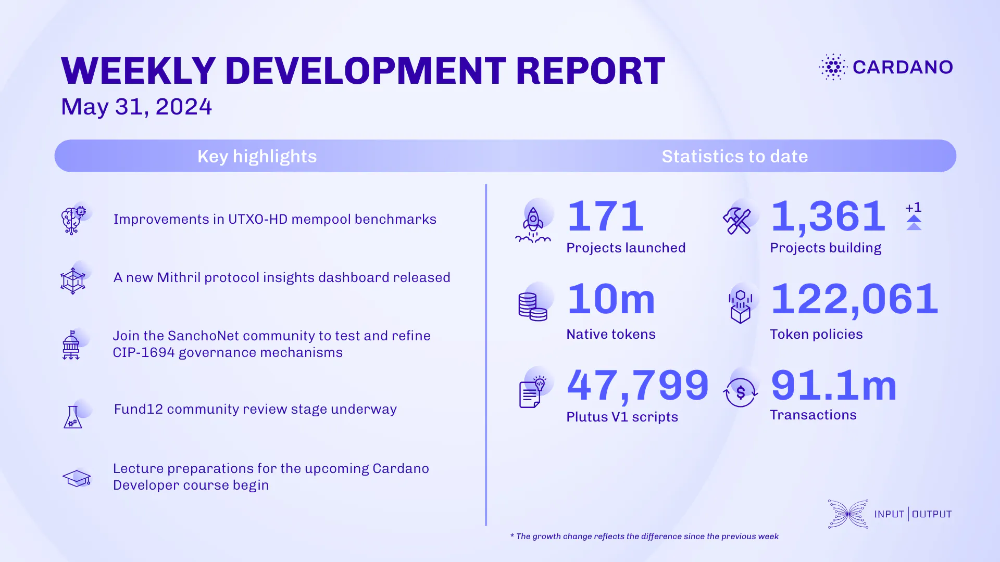

The consensus team advanced the UTXO-HD project using simple diffs, improving mempool benchmarks. They released quickcheck-state-machine library v0.10.0 and rebased UTXO-HD on node v8.11. Technical working groups under Intersect were established, with Plutus and consensus meetings set for early June. Updates on UTXO-HD and Ouroboros Peras were provided. The Hydra team released node v0.17.0, featuring new commit transaction mechanisms and networking upgrades. The Mithril team released a protocol insights dashboard, updated the explorer page, and improved transaction certification. SanchoNet invites community testing for on-chain governance as per CIP-1694, with updated documentation. Project Catalyst hosted town hall 164, with the community review stage ongoing and Fund12 voting registration open. The education team is preparing lectures for the Cardano Developer Course, supporting the DRep Pioneer program, and writing content for Mastering Cardano.

 [**Read more**](https://www.essentialcardano.io/development-update/weekly-development-report-as-of-2024-05-31) 

 

