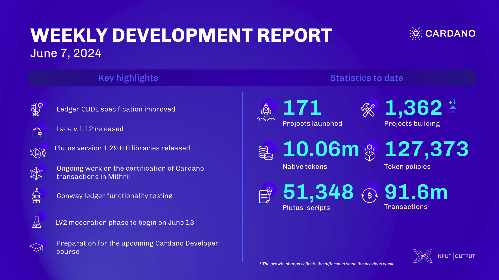

The ledger team enhanced the CDDL specification and improved safety by restricting certain protocol parameter types, introduced tools for controlling test case distribution, worked on UTXO predicate failure tests, enabled retrying of flaky tests in nightly CI, and made further improvements. The Lace team released v1.12, adding a fiat on-ramp with Banxa and enabling multi-delegation for supported hardware wallets. The Plutus team released version 1.29.0.0 of the Plutus libraries, which includes CIP-69 and CIP-117 implementations. The Mithril team improved the throughput of the prover route, transitioned to a chain point-based beacon for faster transaction signing, and prepared a threat modeling explainer for the documentation website. The ledger team continued testing the Conway era and fixed several bugs related to DRep expiry and committee voting thresholds. Intersect updates included interim constitutional committee elections and joining Hyperledger and the Linux Foundation. In Catalyst, town hall 165 shared updates, including the end of the community review period for LV0s and LV1s, and the start of LV2 moderation on June 13. The alternative voting mechanism achieved milestone 1 and was presented during town hall 165. The education team continued working on Mastering Cardano, supporting the DRep Pioneer Program, and preparing for the next Cardano Developer course.

 [**Read more**](https://www.essentialcardano.io/development-update/weekly-development-report-as-of-2024-06-7) 

 

