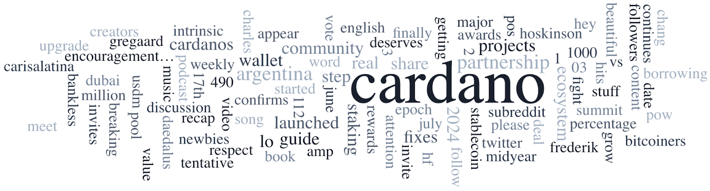

Today, June 10, 2024, is the final day to register for the Interim Constitutional Committee, which will uphold the interim Constitution during the Chang upgrade. The committee includes representatives from IOG, the Cardano Foundation, EMURGO, Intersect, and three community seats. Charles Hoskinson confirmed Cardano Node v9’s release this month, preceding the Chang Hard Fork. The “Spotlight on Stake Pools” series features Dmytro Stashenko of STAT stake pool. Other Cardano news includes updates from Vietnam Blockchain Week, MAV growth, and the Crypto Valley Conference.

 [**Read more**](https://forum.cardano.org/t/digest-june-10-2024-final-call-to-register-your-candidacy-for-the-interim-constitutional-committee-cardano-v9-node-expected-in-june-a-spotlight-on-stake-pools-stat/132826) 

 

