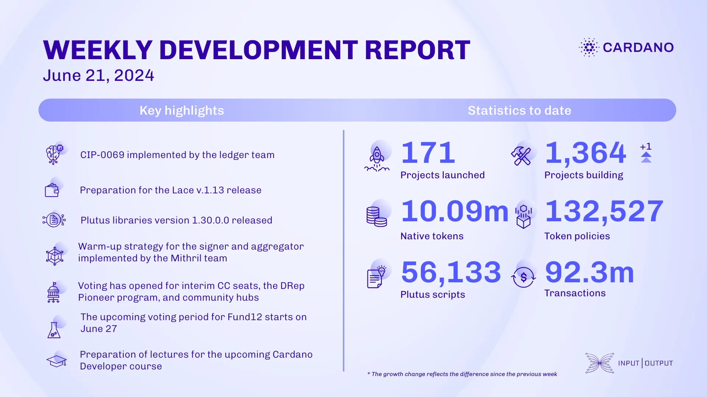

This week, the ledger team implemented CIP-0069, enhancing PlutusV3 functionality by making spending datums optional and enforcing single arguments for scripts. They also fixed script execution and delegation bugs. The Lace team prepares for v.1.13 release. The Plutus team released version 1.30.0.0, featuring CIP-0122 and ledger API refactoring. The Mithril team improved transaction certification and throughput. Voltaire & SanchoNet updates include member-experience improvements and upcoming votes. Catalyst town hall 167 marked the end of community moderation for Fund12, with voting starting June 27. The education team prepares for next month’s Cardano Developer course.

 [**Read more**](https://www.essentialcardano.io/development-update/weekly-development-report-as-of-2024-06-21) 

 

