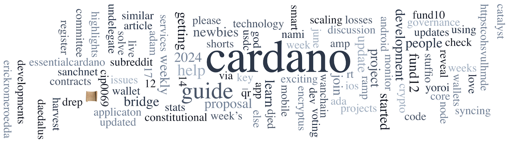

The Interim Constitution was released on June 21, 2024, serving as a temporary document until the Final Constitution is ratified by ada holders by early 2025. Drafting of the final constitution will involve global workshops and a Constitutional Convention. The Interim Constitutional Committee election ended on June 24, 2024, with results expected on June 26 after an audit. The Aiken team reports surpassing 1 million Mainnet transactions with Aiken smart contracts, contributing to 25% of all smart contract traffic. MinSwap completed its final audit on their new Aiken-based implementation, anticipating increased activity. A new full-time engineer, Riley, joins the team, with new libraries and features like property-based testing and backpassing being showcased in projects like Merkle-Patricia Forestry and Fortuna.

 [**Read more**](https://forum.cardano.org/t/digest-june-25-2024-the-interim-constitution-is-now-available-the-interim-constitutional-committee-vote-ends-some-updates-from-the-aiken-team/133440) 

 

