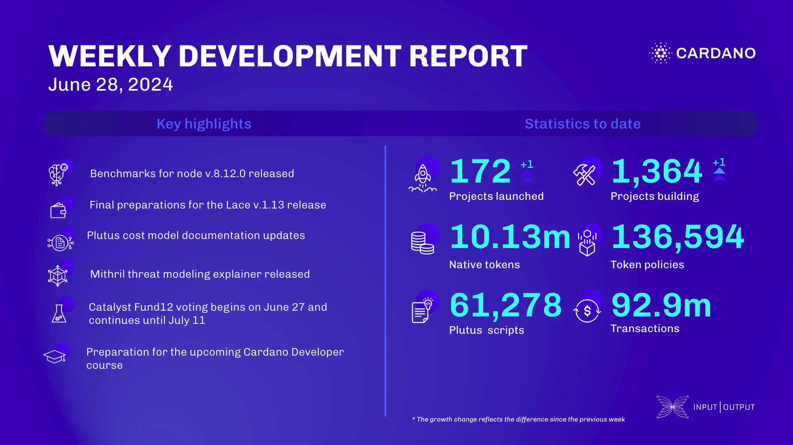

The consensus team optimized db-truncater for speed, supported debugging for bootstrap nodes, and released benchmarks for node v.8.12.0. They also merged a performance fix for node v.8.11, worked on governance action workload, and updated automations for Conway features and the Plutus cost model. The Plutus team overviewed the cost model, designed faster pattern matching, and improved documentation. The Mithril team released a threat modeling explainer, worked on Cardano transaction certification, and improved WASM client documentation. Catalyst released a shortlist of tier-one companies for voting, and the education team updated the Mastering Cardano series and prepared for next month’s developer course.

 [**Read more**](https://www.essentialcardano.io/development-update/weekly-development-report-as-of-2024-06-28) 

 

