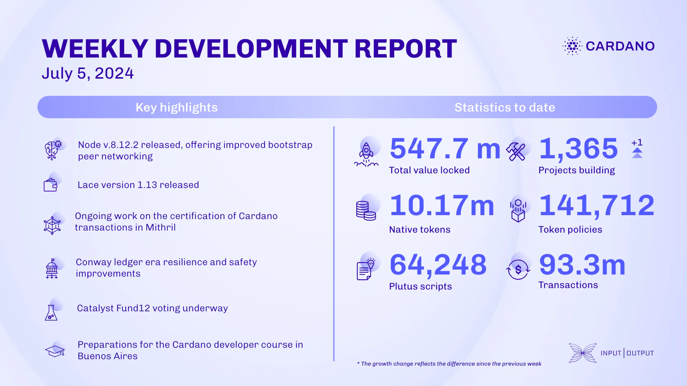

Last week, core technology teams released Cardano node v.8.12.2, enhancing bootstrap peer networking. The ledger team worked on testing and updates, while Lace v.1.13 improved Trezor Safe 3 compatibility. Mithril advanced transaction certification, fixed bugs, and supported node v.8.12. Conway ledger improvements included credential restrictions and a new pricing model. Town hall 169 reported over 1bn ada in voting power. The education team prepared for the Cardano Developer course in Buenos Aires and updated content for Voltaire and Mastering Cardano.

 [**Read more**](https://www.essentialcardano.io/development-update/weekly-development-report-as-of-2024-07-05) 

 

