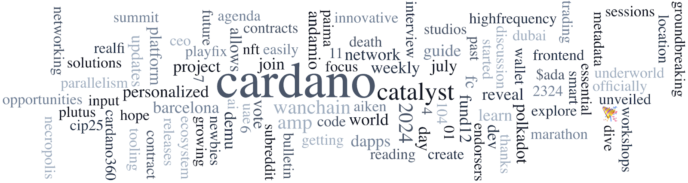

Community voting for Catalyst Fund 12 is active, with 4,800 wallets casting over 180,000 votes, representing 1.6 billion ada. Voting ends on July 11, 2024, at 11:00 AM UTC. The Cardano Foundation published a beginner’s guide to blockchain on July 3, covering its basics, history, types, applications, and regulatory landscape. The “A Spotlight on Stake Pools” series features C3ETH, a pool focused on community and decentralization in the eastern hemisphere. The latest Developer Blog features an interview with Daniel Friedman, CEO of zenGate Global, discussing their platform Palmyra, which tokenizes commodities for transparency in trading. Other news includes confirmed global Constitution Workshop locations, the tentative agenda for the Cardano Summit 2024 in Dubai, Cardano’s adoption of the IBC Protocol for interoperability, and the latest Catalyst newsletter and Essential Cardano development update.

 [**Read more**](https://forum.cardano.org/t/digest-july-8-2024-catalyst-fund-12-voting-ends-on-11-july-blockchain-basics-a-simple-guide-for-beginners-a-spotlight-on-stake-pools-c3eth-developer-blog-series-zengate-global/133928) 

 

